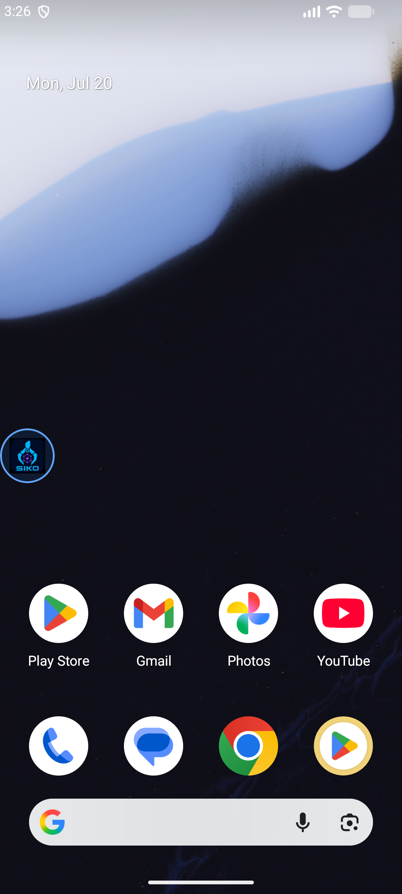
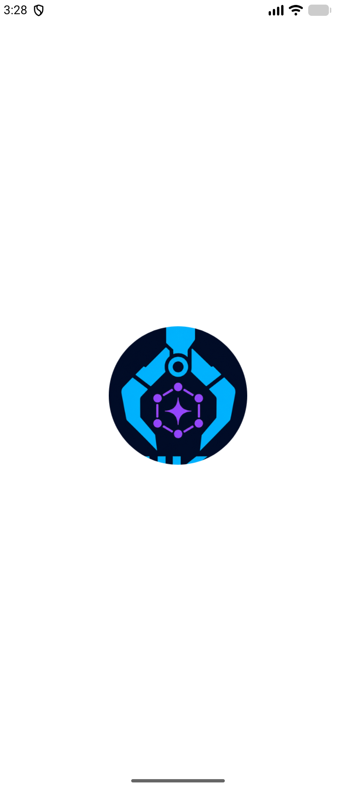
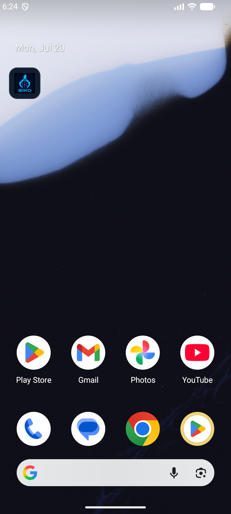

# OctoBot

<p align="center">
  
</p>

<p align="center">
  <strong>A private, extensible AI agent that lives on your Android phone.</strong>
</p>

<p align="center">
  
  
  
</p>

OctoBot is an open-source Android AI agent built from the PokeClaw foundation. It combines chat, device automation, reusable skills, scheduled tasks, external MCP tools, web access, persistent prompts and a private Linux terminal in one phone-resident experience.

The project supports local-first execution as well as OpenAI-compatible cloud providers. The agent can inspect the current screen, choose tools, operate apps and complete multi-step tasks without requiring a permanently connected computer.

## New experience

The latest update introduces OctoBot branding, onboarding, live agent streaming, compact tool activity, provider routing, voice calls, a floating assistant, browser and terminal access, plus unified dark/cyan management screens.

<p align="center">
  
  
  
</p>

<p align="center">
  
</p>

## Highlights

- **On-device agent runtime** — screen understanding, tool selection and multi-step Android automation.
- **Local and cloud models** — local-first inference plus OpenAI-compatible endpoints and model discovery.
- **Manage Tools** — search, filter and enable or disable individual agent tools.
- **Skills** — built-in skills, custom learned skills and per-skill controls.
- **MCP Servers** — connect external Model Context Protocol servers, test connections and manage server state.
- **Cron Jobs** — create, edit, pause and run recurring agent tasks.
- **Persistent prompts** — editable User Prompt, Soul Prompt and Memory with unsaved-change protection.
- **Web access** — background search and download tools available to the agent.
- **Private terminal** — command execution in the agent workspace, copy and clear actions, command history output and responsive keyboard handling.
- **Bundled Alpine environment** — an optional compact Linux workspace with package updates and Git installation support.
- **Attachments** — add images, PDFs and other files to chat requests.
- **Live agent feedback** — streaming responses and visible tool activity during execution.
- **Android automation** — accessibility-based tap, swipe, typing, app launching, notifications and cross-app tasks.

## Redesigned management screens

The following screens now share the same Compose components and visual language as Settings and the main app:

- Manage Tools
- Skills
- MCP Servers and Add MCP Server dialog
- Cron Jobs
- User Prompt
- Soul Prompt
- Memory
- Internal Terminal

The shared UI layer provides consistent top app bars, cards, rows, toggles, status badges, empty states, asynchronous buttons, IME handling and status/navigation bar insets. Terminal is now a first-class destination in the navigation drawer rather than a Settings row.

## Model providers

OctoBot accepts OpenAI-compatible APIs, including providers such as OpenRouter, Groq, Together AI and self-hosted endpoints. Enter an endpoint and API key, retrieve the available models and select the model you want to activate.

## Build

Requirements:

- Android Studio with a current Android SDK
- JDK 17
- Android 9 or newer for the target device

Clone and build:

```bash
git clone https://github.com/seko121/SekoClaw.git
cd SekoClaw
./gradlew assembleDebug
```

On Windows:

```powershell
.\gradlew.bat assembleDebug
```

## Permissions and security

Device automation features require explicit Android permissions such as Accessibility and Notification Access. Terminal access and individual tools can be disabled from the app. API credentials and user configuration remain managed by the existing application storage layer.

Only grant permissions you understand, and review enabled tools before allowing autonomous tasks.

## Project status

OctoBot is under active development. Device behavior can vary by Android version and manufacturer, so real-device reports are welcome through [GitHub Issues](https://github.com/seko121/SekoClaw/issues).

## Attribution

OctoBot is based on the open-source [PokeClaw](https://github.com/agents-io/PokeClaw) project and continues under the repository's Apache 2.0 license and attribution requirements.

## License

Licensed under the [Apache License 2.0](LICENSE).
